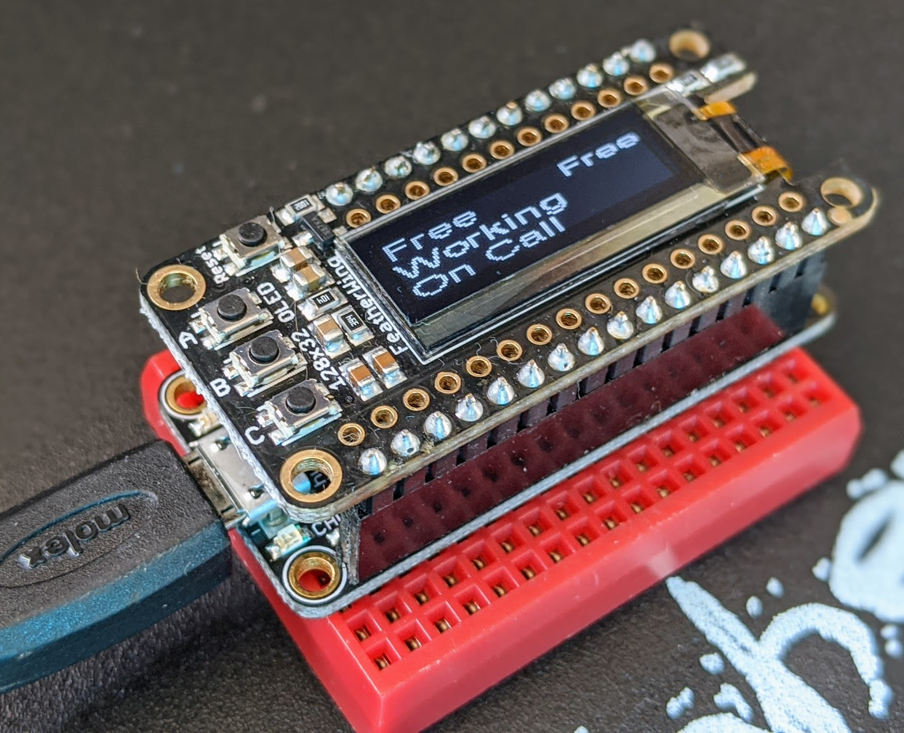
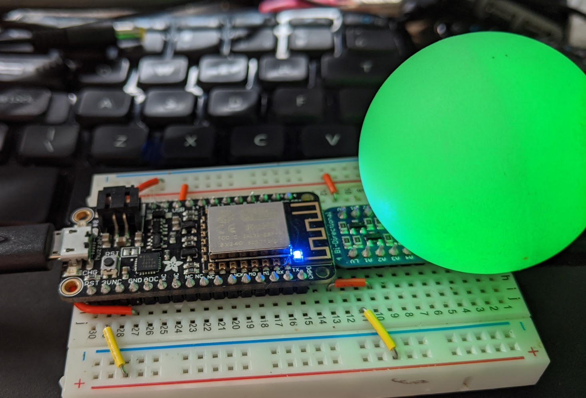
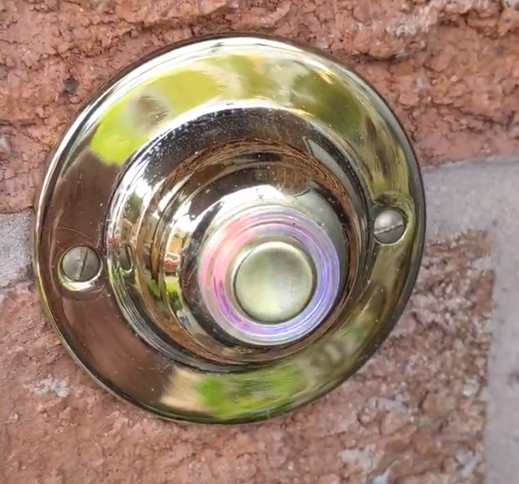
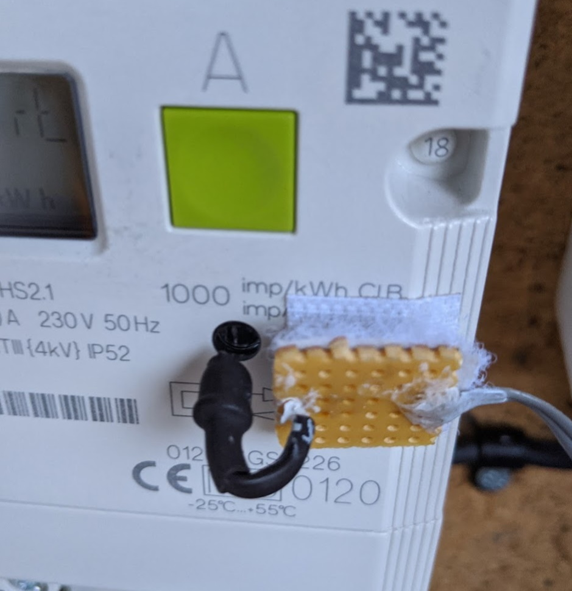

# Home Assistant Configuration

This repository holds my Home Assistant configuration and, centrally, a single collection of ESPHome device configurations so others can find, reuse, and adapt these projects without hunting through separate repositories.

## What you'll find here

- Home Assistant configuration (automations, scripts, sensors, packages) under `includes/`, `packages/`, and top-level YAML files.
- A consolidated `esphome/` directory with many ESPHome YAML device definitions and shared templates in `esphome/common/`.
- Images and fonts used by displays and dashboards in `esphome/images/` and `esphome/fonts/`.
- Several homemade hardware projects with links to supporting repositories.

## Quick links

- ESPHome directory: `esphome/`
- ESPHome common templates: `esphome/common/` (shared components, device base files)
- ESPHome images: `esphome/images/`
- Home Assistant includes: `includes/` (automations, sensors, etc.)

## Highlights — ESPHome devices (pick and reuse)

This section is a short catalog of the most reusable and interesting ESPHome projects in this repo. Each entry includes a brief description and the YAML filename (in the `esphome/` folder) so you can copy and adapt it quickly.

- Busylight (office presence indicator)
  - What: A multi-device setup — a controller and one or more lights — that shows presence/status (busy/available) with Neopixels and a small controller UI.
  - Files: `esphome/busylight-mk2-01.yaml`, `esphome/busylight-mk2-02.yaml`
  - Why reuse: Good example of multi-device coordination, MQTT/Home Assistant integration, and LED effects.

- Doorbell with Neopixel buttons and external sounder
  - What: Doorbell controller with Neopixel buttons, button automation and optional external sounder.
  - File: `esphome/doorbell-controller.yaml`
  - Why reuse: Demonstrates handling buttons, LEDs, and integrating with Home Assistant events.

- Non-invasive power / current sensors
  - What: Current clamp based sensors and SDM120 emulator examples for monitoring mains energy.
  - Files: `esphome/CU-current-clamps.yaml`, `esphome/sdm120_emulator.yaml`
  - Why reuse: Useful starting point for wiring CT clamps, MQTT/Modbus bridging and energy monitoring.

- Air quality & multi-sensor nodes
  - What: PM / VOC / temperature/humidity sensor setups for rooms, lofts and sheds.
  - Files: `esphome/air-quality-sensor-1.yaml`, `esphome/loft-sensors.yaml`, `esphome/shed-sensors.yaml`, `esphome/bedroom-sensors.yaml`
  - Why reuse: Shows robust sensor wiring, filtering, and Home Assistant sensor integration.

- Chest freezer / fridge monitors
  - What: Temperature monitors and alerting patterns for freezers and fridges.
  - Files: `esphome/chest-freezer-monitor.yaml` (and archived examples in `esphome/Archive/`)

- Office blind & air purifier controllers
  - What: Motor / relay control and sensor-driven automation for blinds and air purifiers.
  - Files: `esphome/office-blind-controller.yaml`, `esphome/office-IKEA-Fornuftig-air-purifier.yaml`, `esphome/living-rm-IKEA-Fornuftig-air-purifier.yaml`

There are many other devices and archived experiments in `esphome/Archive/` for inspiration.

## Reuse guide — quick steps to adapt a YAML for your device

1. Install ESPHome or use the Home Assistant ESPHome add-on.
2. Copy the YAML file you want from this repo into your ESPHome projects folder (or use the dashboard's "Import" feature).
3. Update `name:` and `friendly_name:` to something unique.
4. Update WiFi/OTA/`secrets:` references. This repo uses shared base includes in `esphome/common/` — either reuse them or replace them with your own wifi/credentials block.
   - Common templates: `esphome/common/device_base.yaml`, `esphome/common/device_base_wifi.yaml` and other component snippets in `esphome/common/`.
5. Wire sensors/actuators the same way or adapt GPIO pins in the YAML to match your hardware.
6. Compile and flash with the ESPHome dashboard (USB or OTA). Start with a wired USB flash if you are uncertain.
7. Test sensors and automations in Home Assistant, then iterate.

Tips and gotchas

- Secrets: don't commit your WiFi passwords or API keys — use the `secrets:` mechanism. This repo keeps secrets out of the main YAMLs and expects them to be provided locally.
- Device templates: use `esphome/common/` templates to keep YAMLs DRY. If you copy a YAML into another repo, copy or adapt the `common/` includes it depends on.
- Fonts & images: display projects use fonts in `esphome/fonts/` and images in `esphome/images/` — copy these if your device needs them.

## Common components and templates

Shared building blocks live in `esphome/common/`:

- `device_base.yaml` and `device_base_wifi.yaml` — base includes for all devices (name, logger, ota, api, wifi)
- Sensor templates like `bme280.yaml` and `pms5003t.yaml` — plug-and-play sensor configs
- `status_led.yaml` — a standard status LED configuration used by many devices

If you're publishing or forking specific devices, keep the `common/` folder or update includes to point to your own shared templates.

## Other highlights (Home Assistant side)

- RFLink gateway controller and a number of RF-controlled devices (Energenie, Maclean, Status plug sockets, hacked Ikea remotes). See `includes/` and `packages/` for automations and integrations.
- Homemade hardware projects and supporting repos:
  - `ESP8266-433Mhz-Controller-Gateway` — 433MHz MQTT transmitter gateway
  - `Bunny-Shed-Climate-Control` — 433MHz-based bunny shed heater controller
  - `Home-Assistant-RFLink-Gateway-ESP8266` — RFLink gateway firmware
  - `Controllino-Irrigation` and `Irrigation-Controller`

## How to contribute or reuse code

- If you found a device useful, please copy the YAML into your own project and adapt it — keep secrets out.
- If you want me to pull a specific device into its own repo or add better docs for a device, open an issue or send a PR with the improvements you suggest.

## License

This repo follows the licensing indicated in `LICENSE.txt` — please check that file before reusing code in a product.

## Screenshots

---

If you'd like, I can also:

- Generate short READMEs per device inside `esphome/` (e.g., `esphome/README.md` or `esphome/busylight-README.md`) so each device has usage/ wiring/flash notes.
- Add a simple index file `esphome/INDEX.md` that lists every YAML with one-line descriptions (useful for web search and reuse).

Let me know which of those you'd like me to add next and I can create them.

## Inspiration and Support

- [Graeme Smith](https://github.com/Instagraeme)
- [Johan Bloemberg](https://github.com/aequitas)

## My Setup

- Original OS: Windows 10 32-bit virtualization on Windows Server 2016 Hyper-V
- Original Home Assistant: Python folder, home assistant run command run at start-up from shortcut in Windows start-up folder.
- 2nd OS: Ubuntu Server 16.04.1 LTS virtualization on Windows Server 2016 Hyper-V.
- 2nd Home Assistant: Python virtual environment with homeassistant user. As per [Manual installation on a Raspberry Pi](https://www.home-assistant.io/docs/installation/raspberry-pi/). [HASSCTL](https://github.com/dale3h/hassctl) Used for management.
- 3rd OS: Ubuntu Server 18.04.1 LTS virtualization on Windows Server 2016 Hyper-V
- 3rd Home Assistant: Hass.IO in Docker on Ubuntu Server 18.04, as per [these instructions](https://bonani.tech/how-to-install-hass.io-on-ubuntu-server-18.04/)
- Current OS: HASS.IO on Raspberry Pi 4 Model B
- Current Home Assistant: Hass.IO for Raspberry Pi 4 Model B 32bit

### HASSIO Add-ons
- MQTT: [Mosquitto broker](https://github.com/home-assistant/hassio-addons/tree/master/mosquitto) MQTT broker add.
- HTTPS Certificate: [Nginx Proxy Manager](https://github.com/hassio-addons/addon-nginx-proxy-manager)
- OLD HTTPS Certificate originally generated via by home assistant via [Let's Encript Instructions](https://home-assistant.io/docs/ecosystem/certificates/lets_encrypt/), with scripts to auto-update and automations to alert via HTML5 push notification if renew date threshold is close. (Search my repository for `ssl_cert.yaml`)
- [Dasshio](https://github.com/danimtb/dasshio) Hass.io add-on to easily use Amazon Dash Buttons with Home Assistant
- [ESPHome](https://esphome.io/) ESPHome is a system to control your ESP8266/ESP32 by simple yet powerful configuration files and control them remotely through Home Automation systems. Also required MariaDB to be installed.
- [Samba share](https://home-assistant.io/addons/samba/)
- [APC UPS Daemon (No USB)](https://github.com/korylprince/hassio-apcupsd/tree/master/apcupsd_net) View information from APC Network UPSs.
- [AdGuard Home](https://github.com/hassio-addons/addon-adguard-home) Network-wide ads & trackers blocking DNS server.

### ESPHome Things (original examples)
- Busylight, I built so my family can know when I'm busy and working in my Home Office. See `esphome/busylight-mk2-01.yaml` and `esphome/busylight-mk2-02.yaml`.

| BusyLight Controller  | BusyLight Light |
| ------------- | ------------- |
|   |   |

- Doorbell with Neopixel LED buttons and external sounder bell. See `esphome/doorbell-controller.yaml`.

- Non-Invasive Power Meter for House Electricity with visible light phototransistor on LED of electricity meter.

| Doorbell with Neopixel  | Non-Invasive Power Meter |
| ------------- | ------------- |
|    |   |

## Devices

- APC UPS - APC UPS Daemon
- Google Chromecast Audio
- Google Chromecast
- Nest Thermostat
- Plex Media Server
- Amazon Dash Button 
- Axis IP CCTV Cameras
- Raspberry Pi 3 IP CCTV (motion)
- IKEA Trådfri (Tradfri)

#### Items controlled via my `Home-Assistant-RFLink-Gateway-ESP8266`
- Energenie Wall Light Switch MIHO026
- Room lamps plugged into Maclean MCE07GB and Status RCS-K09 remote sockets
- Hacked Ikea E1201C Remote 'relay' for kitchen extractor fan
- Ikea Ansluta Lights with CC2500 Transceiver

## Homemade hardware
- `ESP8266-433Mhz-Controller-Gateway` — Homemade 433Mhz MQTT transmitter gateway
- `Bunny-Shed-Climate-Control` — Homemade 433Mhz bunny shed heating controller
- `Home-Assistant-RFLink-Gateway-ESP8266` — Home Assistant to RFLink Gateway Controller
- `Controllino-Irrigation` — Controllino based irrigation project
- `Irrigation-Controller` — Irrigation controller
