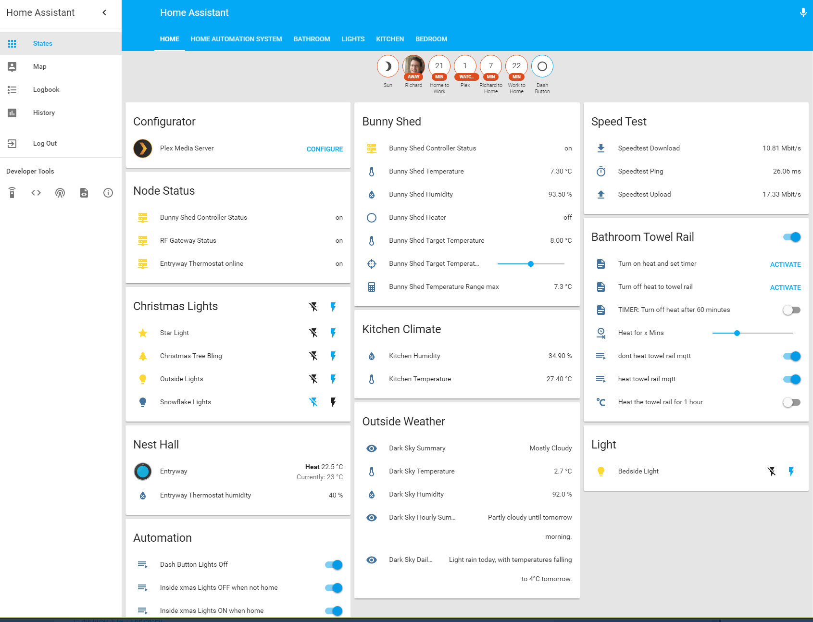

# Home Assistant Configuration

My [Home Assistant](https://home-assistant.io/) Configuration Files

## Inspiration and Support

- [Graeme Smith](https://github.com/Instagraeme)
- [Johan Bloemberg](https://github.com/aequitas)

## My Setup

- Windows 10 32-bit virtualization on Windows Server 2016 Hyper-V
- MQTT: Locally hosted [Mosquitto](https://mosquitto.org/) MQTT broker 
- HTTPS SSL Certificate generated via [Lets Encrypt](https://github.com/Lone-Coder/letsencrypt-win-simple) (Temporally enable IIS server with 433 and 80 bindings and my host name)

## Devices

- HPE ProLiant MicroServer Gen8 Server
- [APC UPS - APC UPS Daemon](http://www.apcupsd.org/wordpress/)
- Google Chromecast Audio
- Google Chromecast
- Nest Thermostat
- Plex Media Server
- Amazon Dash Button 
- Axis P3301 IP CCTV
- [Raspberry Pi 3 IP CCTV](https://github.com/Motion-Project/motion) with help from [link](https://pimylifeup.com/raspberry-pi-webcam-server)

#### Items controlled via my [RFLink Controller](https://github.com/Genestealer/Home-Assistant-RFLink-Gateway-ESP8266)
- [Energenie Wall Light Switch MIHO026](https://energenie4u.co.uk/catalogue/product/MIHO026)
- Room lamps plugged into [Maclean MCE07GB Remote Control Sockets](https://www.amazon.co.uk/Maclean-MCE07GB-Control-Sockets-Programmable/dp/B00OV1TTU6)
- Hacked Ikea E1201C Remote 'relay' for kitchen extractor fan
- Ikea Ansluta Lights

## Github hosted homemade hardware
- [Homemade 433Mhz MQTT transmitter gatway](https://github.com/Genestealer/ESP8266-433Mhz-Controller-Gateway)
- [Homemade 433Mhz bunny shed heating contoller](https://github.com/Genestealer/Bunny-Shed-Climate-Control)
- [Home Assistant to RFLink Gateway Controller](https://github.com/Genestealer/Home-Assistant-RFLink-Gateway-ESP8266)

## Example

